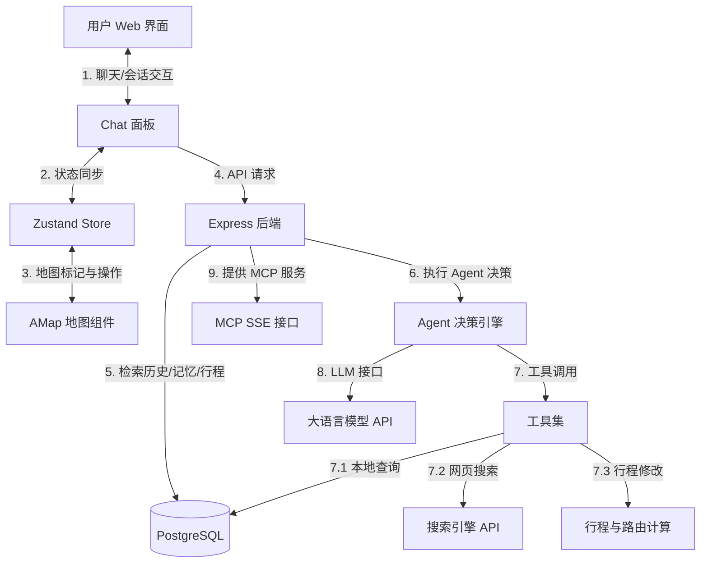

# 对话式 Agent 行程规划助手实现方案

本方案旨在为 Trip 行程规划应用引入一个功能强大、设计精美的**对话式 Agent**。该 Agent 将具备多路查询（数据库 + 网页搜索）、地图交互标记、长短期记忆管理、直接生成及动态修改行程等高级特性，并向外部提供标准 MCP (Model Context Protocol) 接口。

---

## 需求定义与核心场景

### 1. 核心需求概览
* **应用层**：需要对话支持分 Session（会话）管理，并对外提供标准 MCP (Model Context Protocol) 接入支持。
* **Agent 层**：具备完善的记忆管理机制，包括短期记忆（基于会话上下文）和长期记忆（基于用户画像及偏好沉淀）。
* **业务目标**：通过自然的对话交互，辅助用户完成旅行路线的探索、规划与动态修改。

### 2. 典型用户场景与用例

#### 场景一：多路地点查询与地图联标 (以“新疆草原”为例)
* **用户提问**："新疆有哪些草原？"
* **Agent 内部流转**：
  1. 并行触发多路查询：一方面检索应用内数据库（本地已录入的景点与行程数据），另一方面调用网页搜索接口（Web Search）获取最新的草原推荐及相关描述。
  2. 合并去重并提炼景点列表（获取详细的名称、坐标、门票、评分等结构化信息）。
  3. 给出解答，并同时在交互地图上标记出所有涉及的地点。
* **用户体验**：回答文字在聊天面板显示，而相关草原地点自动在右侧高德地图上渲染出专属标记，可点击聚焦。

#### 场景二：智能行程规划与多维度路由设计 (以“伊犁三日游”为例)
* **用户提问**："帮我规划伊犁三日游。"
* **Agent 内部流转**：
  1. Agent 从长期记忆读取用户偏好（如偏好交通方式、自驾还是包车、是否反感爬山等），如记忆不足则主动在对话中询问用户。
  2. 结合地点、时长、当前季度、天气等维度设计一条合理的 3 天行程路线。
  3. 自动在数据库中创建行程（Trip），并依次为每一天规划景点，通过高德 API 自动计算出相邻节点间的路线。
* **用户体验**：对话界面给出行程大纲，并在主界面通过已有的 Trip 详情和 Day Tabs 实时切换渲染，地图上直接呈现出连线路线。

#### 场景三：交互式动态行程调整 (以“不去那拉提”为例)
* **用户提问**："不去那拉提了。"
* **Agent 内部流转**：
  1. Agent 基于当前会话识别出正在编辑的 Trip ID，并调用行程修改工具。
  2. 从行程中删除“那拉提草原”。
  3. 重新编排当天甚至多天的行程顺序，并重算相邻景点间的驾车/步行/骑行路由，将更新同步至数据库。
* **用户体验**：地图上的“那拉提”标记和连线自动更新，行程详情面板的卡片列表即时刷新，无需用户手动拖拽删除。

---

## 架构设计

### 1. 整体数据流与架构



### 2. 长短期记忆机制

- **短期记忆**：以会话（Session）为单位。Agent 在处理当前请求时，会拉取该 Session 下的历史对话消息作为 Context 传入 LLM。
- **长期记忆**：用户的旅行偏好（如“喜欢自然风光”、“讨厌爬山”、“偏好自驾游”等）。
  - **自动提取**：Agent 在对话中通过工具 `save_user_preference` 自动将识别出的用户偏好持久化至 `UserMemory` 表。
  - **检索注入**：每次会话开始时，系统将检索该用户的长期记忆列表，作为 System Prompt 的一部分输入给 LLM。

### 3. 多路地点查询与地图联动

- 当用户询问地点（如“新疆有哪些草原”）时：
  1. Agent 会并行调用 `query_local_places`（检索本地 `places1.json` 导入的地点数据）和 `web_search`（通过 Tavily 等搜索最新景点）。
  2. 合并去重并返回详细信息（包括 `lngLat` 经纬度）。
  3. 后端将推荐的地点列表作为结构化数据存入消息的 `metadata.suggestedPlaces` 中。
  4. 前端接收到后，在 `MapContainer` 上渲染这些地点为特殊的橙色标记（Agent Suggested Markers）。
  5. 用户可在聊天面板中看到这些地点的卡片，点击卡片可将地图视角平移至对应位置，点击“添加到行程”可直接将其加入当前的 Trip 中。

### 4. 智能行程规划与迭代修改

- 当用户请求规划（如“帮我规划伊犁三日游”）时：
  1. Agent 结合长期记忆中的用户偏好，设计出每日路线及景点。
  2. 调用 `create_trip_plan` 工具，在数据库中自动创建 Trip，并依次创建 Day 记录和 Place 记录，接着通过高德地图 API 自动计算景点间的骑行/步行/驾车路线并保存。
  3. 接口返回新创建的 `tripId`，前端检测到后自动切换路由至 `/trip/:id`，使用户能立即在主界面看到规划好的可视化行程。
- 当用户要求修改（如“不去那拉提”）时：
  1. Agent 在会话上下文中获知当前 Trip ID，调用 `modify_trip_plan` 工具。
  2. 工具在数据库中删除“那拉提”这一 Place Item，重新排列该天内其他地点的顺序，并重新调用高德 API 重新计算相邻地点的路线。
  3. 数据库更新完成后，前端通过状态同步更新当前 Trip 状态，地图与行程列表实时重绘。

---

## 数据库设计 (Drizzle Schema)

需要在 `backend/src/db/schema.ts` 中新增三个表：`AgentSession`、`AgentMessage`、`UserMemory`。

```typescript
// backend/src/db/schema.ts

export const agentSessions = pgTable('AgentSession', {
  id: uuid('id').primaryKey().defaultRandom(),
  userId: uuid('userId')
    .notNull()
    .references(() => users.id, { onDelete: 'cascade' }),
  title: text('title').notNull(),
  createdAt: timestamp('createdAt').defaultNow().notNull(),
  updatedAt: timestamp('updatedAt').defaultNow().notNull(),
})

export const agentMessages = pgTable('AgentMessage', {
  id: uuid('id').primaryKey().defaultRandom(),
  sessionId: uuid('sessionId')
    .notNull()
    .references(() => agentSessions.id, { onDelete: 'cascade' }),
  role: text('role').notNull(), // 'user' | 'assistant'
  content: text('content').notNull(),
  metadata: jsonb('metadata'), // 用于存放推荐的景点列表、关联的 tripId、标记点等结构化信息
  createdAt: timestamp('createdAt').defaultNow().notNull(),
})

export const userMemories = pgTable('UserMemory', {
  id: uuid('id').primaryKey().defaultRandom(),
  userId: uuid('userId')
    .notNull()
    .references(() => users.id, { onDelete: 'cascade' }),
  content: text('content').notNull(), // 例如: "不喜欢爬山"
  category: text('category').notNull().default('preference'), // 'preference' | 'habit' | 'experience'
  createdAt: timestamp('createdAt').defaultNow().notNull(),
  updatedAt: timestamp('updatedAt').defaultNow().notNull(),
})

// 表关联
export const agentSessionsRelations = relations(agentSessions, ({ one, many }) => ({
  user: one(users, {
    fields: [agentSessions.userId],
    references: [users.id],
  }),
  messages: many(agentMessages),
}))

export const agentMessagesRelations = relations(agentMessages, ({ one }) => ({
  session: one(agentSessions, {
    fields: [agentMessages.sessionId],
    references: [agentSessions.id],
  }),
}))

export const userMemoriesRelations = relations(userMemories, ({ one }) => ({
  user: one(users, {
    fields: [userMemories.userId],
    references: [users.id],
  }),
}))
```

---

## 接口设计 (API Routes)

### 1. Agent 聊天与会话接口
- `GET /api/agent/sessions` - 获取当前用户的所有会话列表
- `POST /api/agent/sessions` - 创建一个新会话 (body: `{ title?: string }`)
- `DELETE /api/agent/sessions/:id` - 删除某个会话
- `GET /api/agent/sessions/:id/messages` - 获取某个会话的历史消息
- `POST /api/agent/sessions/:id/chat` - 发送消息并触发 Agent 执行 (body: `{ content: string, currentTripId?: string }`)
  - 响应：返回 Assistant 的消息实体，带有 `metadata`（包含建议景点、新增/修改的行程 ID 等）

### 2. MCP 接口 (提供 mcp 接入)
为响应“提供 MCP 接入”的诉求，我们将在后端暴露符合 Model Context Protocol 规范的 SSE (Server-Sent Events) 接口：
- `GET /api/mcp/sse` - MCP 客户端连接端点
- `POST /api/mcp/message` - 发送 JSON-RPC 消息给 MCP 服务器
- Exposed Tools:
  - `query_trip_database(query: string)`: 搜索行程与地点
  - `add_place_to_trip(tripId: string, dayIndex: number, placeName: string, lng: number, lat: number)`: 向行程添加地点
  - `create_new_trip(title: string)`: 创建新行程

---

## Agent 引擎与记忆设计

为构建现代、高效的 Agent 交互体验，我们将结合 GitHub 上目前最流行的 JS/TS AI 开发框架与记忆管理理念进行技术实现：

### 1. 核心框架：Vercel AI SDK (`ai` 包)
我们选择 GitHub 近期最主流的 **Vercel AI SDK** 作为 Agent 的底层驱动框架：
- **自动工具调用循环 (Agentic Loop)**：通过内置的 `generateText` 或 `streamText` 工具调用循环，大模型发出调用请求时自动执行本地 Tool 函数，并在拿到结果后迭代回复，无需人工编写复杂的状态机。
- **打字机流式输出 (Streaming)**：使用 `streamText` 将 Agent 的输出实时流式传输到前端，完美结合流式渲染、实时 Tool 执行状态反馈以及最终的 Markdown 渲染。
- **跨模型支持**：无缝支持 OpenAI、Gemini、Claude 等多种后端 API。

### 2. 记忆系统实现：类 Mem0 的局部自更新长期记忆 (Personalized Long-term Memory)
参考 GitHub 热门项目 **Mem0** 对长期记忆和个性化偏好学习的抽象，我们设计了轻量级、自包含的本地记忆方案：
- **记忆的持久化存储**：建立 `user_memories` 数据库表，存储从对话中学习到的旅行事实（例如："不偏好徒步山路"、"喜欢看自然草原景观"、"伊犁去过喀拉峻并且体验很好"）。
- **记忆检索与注入 (Recall)**：在触发 Agent 聊天会话时，后端首先根据 `userId` 查询所有长期记忆记录。将其作为 System Prompt 的前置上下文，输入给大模型以辅助行程决策。
- **记忆的自动写入与提取 (Save/Retain)**：为 Agent 赋予 `save_user_memory` 工具。在对话过程中，当 LLM 发现用户表达了新的明确偏好（如“我出门一般都自驾，不坐大巴”或“这次出行带小孩”），大模型将自动触发此工具，自动提取结构化偏好（Content & Category）写入或更新 `UserMemory` 表，实现记忆的自我进化与积累。

### 3. Agent 拥有的 Tools：
1. **`web_search`**：调用网页搜索获取最新旅游资讯（可配置 Tavily 搜索服务或简易自定义搜索引擎）。
2. **`query_local_places`**：在本地 `Item` 数据库中根据关键词检索匹配的景点（如已经导入的景德镇、南昌、湖州等地点）。
3. **`save_user_memory`**：自动识别并持久化用户偏好至 `user_memories` 表。
4. **`create_trip_plan`**：接受结构化的天数和景点，一键在数据库中创建 Trip 实体并自动为相邻景点计算高德路由路径。
5. **`modify_trip_plan`**：接受 `{ tripId, action, dayIndex, placeName }`，在数据库中增删地点并触发高德路由重算，返回更新后的 Trip。

---

## 前端设计 (Aesthetics & Interaction)

我们将引入一个**极具科技感与设计感**的 Agent 助手界面，采用高颜值的毛玻璃质感、渐变微动画和极简风格。

### 1. 悬浮 Agent 按钮与抽屉面板
- 界面右下角提供一个渐变霓虹发光的 AI 悬浮球，支持微弱的呼吸动画。
- 点击后，右侧抽屉面板（Agent Panel）平滑移出，遮罩采用毛玻璃背景。
- Panel 顶部为 Session 选择菜单，支持“新建会话”与“历史记录切换”。

### 2. 消息气泡设计
- 用户消息：深蓝色/紫色渐变，右侧对齐。
- Agent 消息：左侧对齐，支持 markdown 渲染，并在底部渲染卡片容器。
  - **地点卡片**：如果 metadata 包含 `suggestedPlaces`，会在消息下方渲染漂亮的地点卡片，展示评分、类别、地址。
    - 鼠标悬停卡片上，地图上的 Marker 随之放大并产生跳跃动画。
    - 点击卡片，地图平滑平移（Pan）到该地点并聚焦。
    - 卡片右下角提供“➕ 添加至当前行程”按钮。
  - **行程规划卡片**：当规划完毕，显示“伊犁三日游已生成”的卡片，点击可一键查看/跳转。

### 3. Zustand 状态库改造
在 `frontend/src/store/index.ts` 中增加 Agent 相关的状态：
- `agentSessions`, `activeSessionId`, `agentMessages`, `agentSuggestedPlaces` (临时推荐点)
- `sendAgentMessage` 触发 API 请求，处理 metadata。若检测到 `tripId` 发生变化或新建，通知页面重新加载行程。
- `addSuggestedPlaceToTrip` 将推荐的临时地点加入当前 Trip 的指定天数中。

---

## Open Questions

> [!IMPORTANT]
> 1. **大语言模型 (LLM) 接口提供方选择**：您是否有特定的大模型 API 偏好（例如 Gemini、OpenAI、Claude、DeepSeek 等）？我们建议在后端 `.env` 中提供 `LLM_API_KEY`、`LLM_BASE_URL` 和 `LLM_MODEL` 以便灵活配置。
> 2. **网页搜索 API 选择**：对于多路查询中的网页搜索工具，是否使用主流的 Tavily 搜索服务，或是本地模拟/自定义搜索？若使用 Tavily，需要配置 `TAVILY_API_KEY`。

---

## 验证与测试方案

### 1. 单元与接口测试
- 编写脚本测试 Agent Tool Calling 的正确性：
  - 测试 `create_trip_plan` 生成的多天行程是否数据库写入完整，高德 API 路线是否重构计算正确。
  - 测试 `modify_trip_plan` 在删除某个景点后，剩余路线是否能闭合且重新生成。
- 测试 `user_memories` 长期记忆的读写隔离性。

### 2. 手动集成测试 (UI)
- 在地图上测试：
  - 询问“新疆有哪些草原”后，橙色临时 Marker 能否全部标记到高德地图上，并且点击时视角能否正确定位。
  - 点击“添加到行程”，该草原是否能实时进入右侧 Day 面板。
- 在对话中测试：
  - 问：“我不喜欢爬山，更喜欢草原自驾”。检查 `UserMemory` 是否增加对应条目。
  - 问：“帮我规划伊犁三日游”，确认能自动跳转详情页展示 3 日规划。
  - 接着输入：“不要去那拉提，改去唐布拉”，确认那拉提被删除，唐布拉被自动添加，并且地图路线自动重绘。
